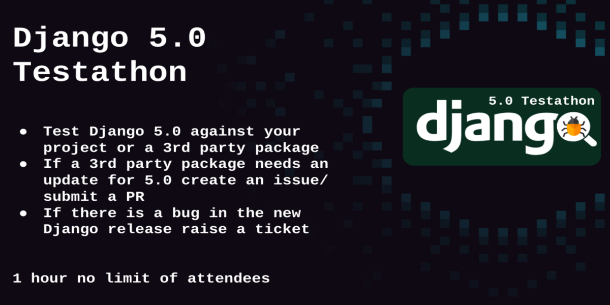

# (Workshop) Supercharge your Developer Experience with VS Code, Dev Containers and Codespaces
Supercharge your DX with VS Code and Dev Containers Workshop

## Table of Contents
- [Set Up Instructions](#Set-up-instructions)
  - [VS Code](#vs-code)
  - [Dev Containers](#dev-containers)
  - [Codespaces](#codespaces)
- [Workshop Sessions](#Sessions)
- [FAQ](#faq)

## Set Up Instructions

### VS Code
Free and built on open source. Integrated Git, debugging and extesnsions. You have the option between VS Code Stable and Insiders which are installed side-by-side, which means you can switch between the two independently. 

- [Intro to VS Code (Video)](https://youtu.be/B-s71n0dHUk?si=a5ljKKuMUZyoJGS3)

- [Iteration Plans](https://github.com/microsoft/vscode/wiki/Iteration-Plans)

- [Roadmap](https://github.com/microsoft/vscode/wiki/Roadmap)

||VS Code Stable| VS Code Insiders |
|-------|--------------|------------------|
|Description|Stable VS Code release monthly.|The most recent code pushes for early adopters interested in troubleshooting VS Code, frequent builds with features and bug fixes|
|Release Notes|[latest](https://code.visualstudio.com/updates/)|-|
|Python Release Notes|[September 2023](https://devblogs.microsoft.com/python/python-in-visual-studio-code-september-2023-release/)|-|
|Download|⭐[Install](https://code.visualstudio.com/download)|⭐[Install](https://code.visualstudio.com/insiders/)|
|Anywhere, anytime, entirely in your browser|[visit](https://vscode.dev/)|[visit](https://insiders.vscode.dev/)|

### Dev Containers

Dev Containers or "Development Containers" is an open spec for enriching containers with development specific content and settings. Created by Microsoft, it was first supported by VS Code but now supported by IntelliJ IDEA, Cochix devenv, Jetpack.io, Codespaces, DevPod [and more](https://containers.dev/supporting).

[Intro to Dev Containers + GitHub Codespaces - Live stream](https://www.youtube.com/watch?v=JTHTWp9DIZQ)

[Open Spec - Docs - containers.dev](https://containers.dev/)

⭐[Install/Use with VS Code Tutorial](https://code.visualstudio.com/docs/devcontainers/tutorial)

### Codespaces
Code spaces is a development environment that is hosted in the cloud. It's built with the same tools as VS Code and Dev Containers, but you now have cloud compute in a Docker container, running on a virtual machine. YOu chan chose your machine types and cores, ram and storage. 

⭐ [Play with the Codespaces Quick Start](https://docs.github.com/en/codespaces/getting-started/quickstart)

Note: You can do this demo with *any* Django repo on GitHub. Try it out!

## What you'll be building
You're going to walk away with a ton of examples and save your own custom settings.

## Sessions

|||
|---|---|
|VS Code for Python| [VS Code Python Walkthrough](#activity-vs-code-python-walkthrough-🔗)|
|VS Code for Python| [VS Code Python Guide](#guide-vs-code-python-🔗)|
|VS Code for Python| [Customize your VS Code settings](#activity-vs-code-customize-your-settings-🔗)|
|VS Code for Python| [Python and Django IntelliSense](#activity-vs-code-python-and-django-intellisense-🔗)|
|Supercharged Features|[Code Completion, AI and Copilot](#codecompletion-ai-and-copilot-🔗)|
|Dev Containers|[Dev Containers for Python and Django](#dev-containers-for-python-and-django🔗)|
|Codespaces|[Codespaces for Python and Django](#codespaces-for-python-and-django)|
|Example Scenarios|[Creating a Package](#activity-creating-a-python-package-🔗)|
|Example Scenarios|[Onboarding a New Team Member](#activity-onboarding-a-new-team-member-🔗)|
|Example Scenarios|[Keeping Code Clean](#activity-keeping-code-clean-🔗)|
|Example Scenarios|[Performing a Routine Task](#activity-performing-a-routine-task-or-remote-development-🔗)|
|Example Scenarios|[User Testing a Feature](#activity-user-testing-a-feature-🔗)|
|Example Scenarios|[Writing Playwright Tests](#activity-writing-playwright-test-🔗)|
|Example Scenarios|[Deploying Django from VS Code](#activity-deploying-django-from-vs-code-🔗)|
<!-- |Example Scenarios|[Exploring Your PostgreSQL database](#activity-exploring-your-postgresql-database-🔗)| 
|Example Scenarios|[Refactoring Old Django Code or upgrading Django](#activity-refactoring-old-django-code-🔗)|
|Example Scenarios|[Debugging Django](#activity-debugging-django-🔗)|
 |Example Scenarios|[Custom (Model and Query) Managers in Django]() (Coming Soon 🚧)| -->

### VS Code for Python 🔗

#### Activity: VS Code Python Walkthrough 🔗

#### Guide: VS Code Python 🔗

<iframe loading="lazy" style="position: relative; width: 100%; height: 600px; max-height: 80vh; border: none; padding: 0; margin: 0; overflow: hidden;"
      src="https:&#x2F;&#x2F;www.canva.com&#x2F;design&#x2F;DAFuxPrK3EU&#x2F;view?embed" allowfullscreen="allowfullscreen" allow="fullscreen">
</iframe>

<a href="https://www.canva.com/design/DAFuxPrK3EU/view">share guide🛠️</a>

#### Activity: VS Code Customize your Settings 🔗

Using the VS Code Python Guide, check out the Editor and Environment Settings infographic. This is where your settings live. Now let's check out what you can change.

[ ] Visuals

  [ ] Themes: [https://vscodethemes.com/ 3rd Party Extensions list](https://vscodethemes.com/)

  [ ] Icons: [VS Code Marketplace Icon Extensions](https://marketplace.visualstudio.com/search?term=Icons&target=VSCode&category=All%20categories&sortBy=Relevance)
  
  [ ] Fonts

[ ] Terminal: [VS Code Terminal](https://code.visualstudio.com/docs/terminal/basics)

[ ] Snippets: [Django Snippets Extension](https://marketplace.visualstudio.com/items?itemName=batisteo.vscode-django)

[ ] Linters: [Linting Python in VS Code](https://code.visualstudio.com/docs/python/linting)

[ ] Formatters: [Formatting Python in VS Code](https://code.visualstudio.com/docs/python/formatting)

[ ] Environments: [Python Environments in VS Code](https://code.visualstudio.com/docs/python/environments)

|Profile Name	| VS Code stable | VS Code insiders |
|---|---|---|	
|GitHub Extension|VS Code: https://aka.ms/PythonPulse/ep/8/profile | VS Code Insiders: https://aka.ms/PythonPulse/ep/8/insiders-profile |
| Data Wrangler	|VS Code: https://aka.ms/PythonPulse/ep/7/profile | VS Code Insiders: https://aka.ms/PythonPulse/ep/7/insiders-profile |	
| Python Testing |VS Code: https://aka.ms/PythonPulse/ep/9/profile| VS Code Insiders: https://aka.ms/PythonPulse/ep/9/insiders-profile |
| Data Science |	VS Code: https://aka.ms/PythonPulse/ep/10/profile | VS Code Insiders: https://aka.ms/PythonPulse/ep/10/insiders-profile	|

#### Activity: VS Code Python and Django IntelliSense 🔗
If you do not have a codebase you feel comfortable perusing during the workshop, feel free to use the Djangonaut Space website codebase: [https://github.com/djangonaut-space/wagtail-indymeet](https://github.com/djangonaut-space/wagtail-indymeet)
- Start with the Python Extension: Leverages all of VS Code's power to provide auto complete, IntelliSense, Linting, Debugging and Unit Testing, along with the ability to switch between Python versions
- Select Interpreter
- Autocomplete + IntelliSense: Combines together a few features together including code completion and variable suggestions.
- "Code Actions"
- Linting and formatters

> 💡Tip: IntelliSense suggestions can be configured with `editor.quickSuggestions` and `editor.suggestOnTriggerCharacters`

<!-- #### Guide: Keeping your Code Clean - Python Linters 🔗
- Black
- AutoPep8 -->

### VS Code Supercharged Features 🔗

#### Codecompletion, AI and Copilot 🔗
- [Effortless Python with GitHub Copilot (Video)](https://youtu.be/DSHfHT5qnGc)
- [Prompting with Copilot](https://youtu.be/ImWfIDTxn7E)
- [Using Copilot with Jupyter Notebooks (Video)](https://youtu.be/QS_bh-3qKdw)
- [Learning Data Science from SCRATCH (with GitHub CoPilot) (Video)](https://youtu.be/C_0mtbAWNtQ)

#### Portable Mode🔗
[VS Code Portable Mode](https://code.visualstudio.com/docs/editor/portable) allows all data created by VS Code to live near itself. This enables fun things like putting VS Code on an arduino for example!

#### Zen Mode🔗
- [VS Code Zen Mode](https://code.visualstudio.com/docs/getstarted/userinterface#_zen-mode)

Turning on Zen Mode will now also hide editor line numbers. This behavior can be controlled via `zenMode.hideLineNumbers` setting.

#### Screencast Mode🔗
- [Screencast mode](https://code.visualstudio.com/updates/v1_31#_screencast-mode)

### Dev Containers for Python and Django🔗

#### Guide: Diving into Dev Containers with Django and Python 🔗

<iframe loading="lazy" style="position: relative; width: 100%; height: 600px; max-height: 80vh; border: none; padding: 0; margin: 0; overflow: hidden;"
      src="https:&#x2F;&#x2F;www.canva.com&#x2F;design&#x2F;DAFwon7SVHc&#x2F;view?embed" allowfullscreen="allowfullscreen" allow="fullscreen">
    </iframe>

<a href="https://www.canva.com/design/DAFwon7SVHc/view">share guide🛠️</a>

- [Django Dev Containers (Video)](https://youtu.be/pf_SmZ-gkRM)

### Codespaces for Python and Django

#### Activity: Codespaces for Python and Django
- [Using PostgreSQL inside VS Code Dev Containers](https://www.youtube.com/live/JTHTWp9DIZQ?si=jLVh0qLfMV3jhbmH)
- [Codespaces](https://code.visualstudio.com/docs/remote/codespaces)

### VS Code for Python - Example Scenarios 🔗
If there is more time after going through workshop materials or if the group prefer to be left to their own hacking with periodic check-ins, these are the key scenarios I think VS Code can help with. Each person can pick their own activity check ins every 15 minutes to see how their activity is going in VS Code, Dev Containers and/or Codespaces. 

#### Activity: Enabling Accessiblility tools in VS Code
- 🆕[Accessibility in VS Code (Video)](https://www.youtube.com/embed/iFPsrvjZ9yo?si=Ezk0K3XMRdbJHazk)
- [VS Code Accessibility](https://code.visualstudio.com/docs/editor/accessibility)
<!-- #### Activity: Refactoring Old Django Code 🔗-->

#### Activity: Creating a Python Package 🔗
- [Mypy Stubs in VS Code](https://dev.to/jodaut/python-type-checking-with-visual-studio-code-46a7)
- [This VS Code update can type hint your Python code (Video)](https://www.youtube.com/watch?v=hHBp0r4w86g)
- [Setuptools](https://setuptools.pypa.io/en/latest/setuptools.html)
- [Python task provider extension](https://marketplace.visualstudio.com/items?itemName=tonybaloney.python-task-provider)

<!-- #### Activity: Debugging Django 🔗-->

#### Activity: Onboarding a new Team Member 🔗
- [Markdown Preview Mermaid Support Extension](https://marketplace.visualstudio.com/items?itemName=bierner.markdown-mermaid)
- [VS Code Profiles](https://code.visualstudio.com/docs/editor/profiles)
- [Using PostgreSQL inside VS Code Dev Containers](https://www.youtube.com/live/JTHTWp9DIZQ?si=jLVh0qLfMV3jhbmH)

#### Activity: Keeping Code Clean 🔗
- 🆕[Ruff Linter Extension](https://marketplace.visualstudio.com/items?itemName=charliermarsh.ruff)
- 🆕[Linting Python in VS Code](https://code.visualstudio.com/docs/python/linting)
- [Black Formatter Extension](https://marketplace.visualstudio.com/items?itemName=ms-python.black-formatter)

#### Activity: Playing with Data 🔗
- [Data Wrangler - Extension (Video)](https://youtu.be/gc0Hm1NpYPo)
- [Jupyter Notebooks Extension](https://marketplace.visualstudio.com/items?itemName=ms-toolsai.jupyter-keymap)
- 🆕[Data Wrangler Extension](https://marketplace.visualstudio.com/items?itemName=ms-toolsai.datawrangler)
- [Data Science for Everyone and Everywhere (Video)](https://youtu.be/3JvIS2lvkqQ?si=T-bZrgSW_yBurdcL)
- [Jupyter Notebook Extension Documentation](https://code.visualstudio.com/docs/datascience/jupyter-notebooks)
- [VS Code Data Science Tutorial](https://code.visualstudio.com/docs/datascience/data-science-tutorial)
- [Azure Machine Learning Tutorial](https://code.visualstudio.com/docs/datascience/azure-machine-learning)

#### Activity: Performing a Routine Task or Remote Development 🔗
- [VS Code Tasks](https://code.visualstudio.com/Docs/editor/tasks)
- [VS Code Remote Tunnels](https://code.visualstudio.com/docs/remote/tunnels)
- [VS Code Snippets](https://code.visualstudio.com/docs/editor/userdefinedsnippets)
- [VS Code SSH](https://code.visualstudio.com/docs/remote/ssh)
- [Windows Subsystem Linux](https://code.visualstudio.com/docs/remote/wsl)

#### Activity: User Testing a Feature 🔗
- [Codespaces](https://code.visualstudio.com/docs/remote/codespaces)
- [Dev Containers](https://containers.dev/)
- 🆕[VS Code Port Forwarding](https://code.visualstudio.com/docs/editor/port-forwarding)
- [VS Code Source Control](https://code.visualstudio.com/docs/sourcecontrol/overview)
- [VS Code Live Share](https://visualstudio.microsoft.com/services/live-share/)
- [Github Pull Requests and Issues](https://marketplace.visualstudio.com/items?itemName=GitHub.vscode-pull-request-github)

#### Activity: Writing Playwright Test 🔗
- [Python Playwright](https://playwright.dev/python/docs/intro)
- [PyOhio - A Quickstart to Web Testing with Playwright (Video)](https://www.pyohio.org/2022/program/talks/a-quickstart-to-web-testing-with-playwright)

#### Activity: Deploying Django from VS Code 🔗
- [Getting the most out of Python with VS Code and Azure (Video)](https://www.youtube.com/watch?v=fvFBnulY_M0)
- [Speedrun your deployments from VS Code (Video)](https://youtu.be/yu4q-iLMtKA)
- [Deploy your django app to Azure](https://learn.microsoft.com/en-us/azure/app-service/quickstart-python?tabs=django%2Cwindows%2Cazure-cli%2Cvscode-deploy%2Cdeploy-instructions-azportal%2Cterminal-bash%2Cdeploy-instructions-zip-azcli)

<!-- #### Activity: Exploring Your PostgreSQL database 🔗 -->

Your debugger settings for your workspace go in your launch.json in your `.vscode` settings directory.

- Sunday 15th October 08:30 UTC [https://everytimezone.com/?t=652b2b80,1fe](https://everytimezone.com/?t=652b2b80,1fe)
- Friday 20th October 16:30 UTC [https://everytimezone.com/?t=6531c300,366](https://everytimezone.com/?t=6531c300,366)

<!-- ### 🧠 Knowledge Check

<iframe loading="lazy" style="position: relative; width: 100%; height: 600px;  max-height: 80vh; border: none; padding: 0;margin: 0; overflow: hidden;"
      src="https:&#x2F;&#x2F;www.canva.com&#x2F;design&#x2F;DAFvdoiBZTk&#x2F;view?embed" allowfullscreen="allowfullscreen" allow="fullscreen">
</iframe>

 -->

## FAQ
- By default VS Code Auto updates to new version.
- You can disable VS Code telemetry which removes the need for VSCodium while allowing you to use VS Code's full set of features.
- VS Code lets you control text indentation and whether you'd like to use spaces or tab stops. By default, VS Code inserts spaces & uses 4 spaces per tab key. VS Code will analyze your open file and determine indentation used in the document. The auto detection overrides indentation settings.
- [Workspace Trust](https://code.visualstudio.com/docs/editor/workspace-trust) lets you decide whether code in your folder can be executed by VS Code and extensions without your explicit approval. This allows for safe code browsing working in "Restricted Mode"  

------
<iframe width="100%" height="480px" src="https://forms.office.com/Pages/ResponsePage.aspx?id=v4j5cvGGr0GRqy180BHbR2b76UpVDQNHl19NWgNYHeNURDdMNUNPREdEUzNZSTFCRlE4UjZaWDNCNy4u&embed=true" frameborder="0" marginwidth="0" marginheight="0" style="border: none; max-width:100%; max-height:100vh" allowfullscreen webkitallowfullscreen mozallowfullscreen msallowfullscreen> </iframe>