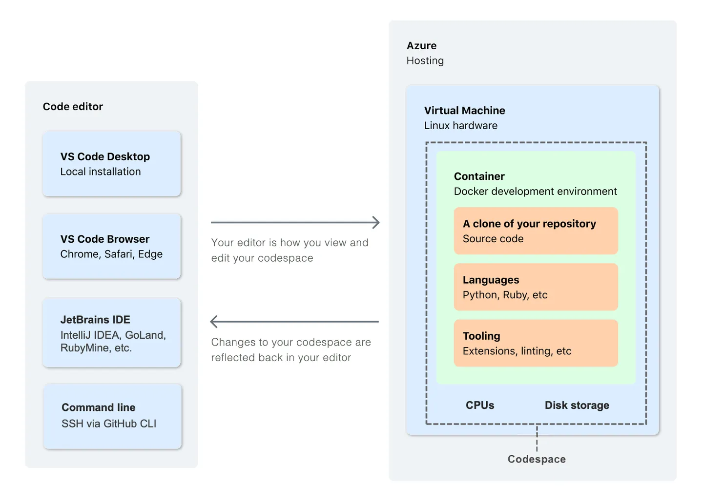

# (Workshop) Supercharge your Developer Experience with VS Code, Dev Containers and Codespaces
Supercharge your DX with VS Code and Dev Containers Workshop

## Set Up Instructions

### VS Code
Free and built on open source. Integrated Git, debugging and extesnsions. You have the option between VS Code Stable and Insiders which are installed side-by-side, which means you can switch between the two independently. 

[Intro to VS Code (Video)](https://youtu.be/B-s71n0dHUk?si=a5ljKKuMUZyoJGS3)

[Iteration Plans](https://github.com/microsoft/vscode/wiki/Iteration-Plans)

[Roadmap](https://github.com/microsoft/vscode/wiki/Roadmap)

||VS Code Stable| VS Code Insiders |
|-------|--------------|------------------|
|Description|Stable VS Code release monthly.|The most recent code pushes for early adopters interested in troubleshooting VS Code, frequent builds with features and bug fixes|
|Release Notes|[latest](https://code.visualstudio.com/updates/)|-|
|Python Release Notes|[September 2023](https://devblogs.microsoft.com/python/python-in-visual-studio-code-september-2023-release/)|-|
|Download|⭐[Install](https://code.visualstudio.com/download)|⭐[Install](https://code.visualstudio.com/insiders/)|
|Anywhere, anytime, entirely in your browser|[visit](https://vscode.dev/)|[visit](https://insiders.vscode.dev/)|

### Dev Containers

Dev Containers or "Development Containers" is an open spec for enriching containers with development specific content and settings. Created by Microsoft, it was first supported by VS Code but now supported by IntelliJ IDEA, Cochix devenv, Jetpack.io, Codespaces, DevPod [and more](https://containers.dev/supporting).

[Intro to Dev Containers + GitHub Codespaces - Live stream](https://www.youtube.com/watch?v=JTHTWp9DIZQ)

[Open Spec - Docs - containers.dev](https://containers.dev/)

⭐[Install/Use with VS Code Tutorial](https://code.visualstudio.com/docs/devcontainers/tutorial)

### Codespaces
Code spaces is a development environment that is hosted in the cloud. It's built with the same tools as VS Code and Dev Containers, but you now have cloud compute in a Docker container, running on a virtual machine. YOu chan chose your machine types and cores, ram and storage. 

⭐ [Play with the Codespaces Quick Start](https://docs.github.com/en/codespaces/getting-started/quickstart)

Note: You can do this demo with *any* Django repo on GitHub. Try it out!

## What you'll be building
You're going to walk away with a 💩 ton of examples and save your own custom settings.

## Sessions

|||
|---|---|
|VS Code for Python| VS Code Python Walkthrough|
|VS Code for Python| VS Code Python Guide|
|VS Code for Python| Customize your VS Code settings|
|VS Code for Python| Python and Django IntelliSense|
|Supercharged Features|Code Completion, AI and Copilot|
|Example Scenarios|[Custom (Model and Query) Managers in Django]() (Coming Soon)|
|Example Scenarios|[Refactoring Old Django Code]()|
|Example Scenarios|[Creating a Package]()|
|Example Scenarios|[Debugging Django]()|
|Example Scenarios|[Onboarding a New Team Member]()|
|Example Scenarios|[Keeping Code Clean]()|
|Example Scenarios|[Performing Some a Task]()|
|Example Scenarios|[User Testing]()|
|Example Scenarios|[Writing Playwright Tests]()|
|Example Scenarios|[Deploying Django from VS Code](), [Exploring Your PostgreSQL database]()|
|Example Scenarios|[Exploring Your PostgreSQL database]()|

|||

### VS Code for Python 🔗

#### Activity: VS Code Python Walkthrough 🔗🔗

#### Guide: VS Code Python 🔗

<iframe loading="lazy" style="position: relative; width: 105%; height: 600px; max-height: 80vh; border: none; padding: 0; margin: 0; overflow: hidden;"
      src="https:&#x2F;&#x2F;www.canva.com&#x2F;design&#x2F;DAFuxPrK3EU&#x2F;view?embed" allowfullscreen="allowfullscreen" allow="fullscreen">
</iframe>

#### Activity: VS Code Customize your Settings 🔗

Using the VS Code Python Guide, check out the Editor and Environment Settings infographic. This is where your settings live. Now let's check out what you can change.
- Visuals
  - Themes
  - Icons
  - Fonts
- Terminal
- Snippets
- Environments

#### Activity: VS Code Python and Django IntelliSense 🔗
If you do not have a codebase you feel comfortable perusing during the workshop, feel free to use the Djangonaut Space website codebase: [https://github.com/djangonaut-space/wagtail-indymeet](https://github.com/djangonaut-space/wagtail-indymeet)

### VS Code Supercharged Features

#### Codecompletion, AI and Copilot

#### Portable Mode

#### Zen Mode

#### Screencast Mode

### VS Code for Python - Example Scenarios 🔗

<iframe loading="lazy" style="position: relative; width: 100%; height: 600px;  max-height: 80vh; border: none; padding: 0;margin: 0; overflow: hidden;"
      src="https:&#x2F;&#x2F;www.canva.com&#x2F;design&#x2F;DAFvdoiBZTk&#x2F;view?embed" allowfullscreen="allowfullscreen" allow="fullscreen">
</iframe>

#### Activity: Refactoring Old Django Code 🔗

#### Activity: Python and Django Debugging 🔗
Your debugger settings for your workspace go in your launch.json in your `.vscode` settings directory.

#### Guide: Keeping your Code Clean - Python Linters 🔗
- Black
- AutoPep8

  <iframe loading="lazy" style="position: absolute; width: 100%; height: 600px; max-height: 80vh; border: none; padding: 0;margin: 0; overflow: hidden;"
    src="https:&#x2F;&#x2F;www.canva.com&#x2F;design&#x2F;DAFvkILnmMk&#x2F;view?embed" allowfullscreen="allowfullscreen" allow="fullscreen">
  </iframe>

## FAQ
- By default VS Code Auto updates to new version.
- You can disable VS Code telemetry which removes the need for VSCodium while allowing you to use VS Code's full set of features.
- VS Code lets you control text indentation and whether you'd like to use spaces or tab stops. By default, VS Code inserts spaces & uses 4 spaces per tab key. VS Code will analyze your open file and determine indentation used in the document. The auto detection overrides indentation settings.
- [Workspace Trust](https://code.visualstudio.com/docs/editor/workspace-trust) lets you decide whether code in your folder can be executed by VS Code and extensions without your explicit approval. This allows for safe code browsing working in "Restricted Mode"  
