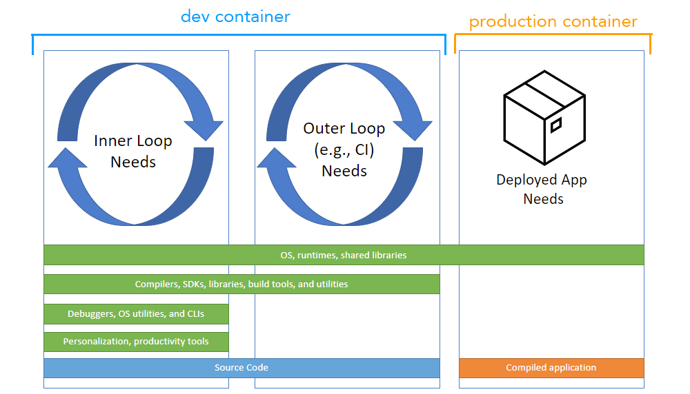

# (Workshop) Supercharge your Developer Experience with VS Code, Dev Containers and Codespaces
Supercharge your DX with VS Code and Dev Containers Workshop

Thank you so much for joining! 

Needed for the day:
- Any computer with any operating system and reliable internet connection.
- Thats it!

The goal is to give you tools to code however you need to, wherever you need to with whomever you need to. 

## Set Up Instructions

### VS Code
Free and built on open source. Integrated Git, debugging and extesnsions. You have the option between VS Code Stable and Insiders which are installed side-by-side, which means you can switch between the two independently. 

[Intro to VS Code (Video)](https://youtu.be/B-s71n0dHUk?si=a5ljKKuMUZyoJGS3)

[Iteration Plans](https://github.com/microsoft/vscode/wiki/Iteration-Plans)

[Roadmap](https://github.com/microsoft/vscode/wiki/Roadmap)

||VS Code Stable| VS Code Insiders |
|-------|--------------|------------------|
|Description|Stable VS Code release monthly.|The most recent code pushes for early adopters interested in troubleshooting VS Code, frequent builds with features and bug fixes|
|Release Notes|[latest](https://code.visualstudio.com/updates/)|-|
|Python Release Notes|[September 2023](https://devblogs.microsoft.com/python/python-in-visual-studio-code-september-2023-release/)|-|
|Download|⭐[Install](https://code.visualstudio.com/download)|⭐[Install](https://code.visualstudio.com/insiders/)|
|Anywhere, anytime, entirely in your browser|[visit](https://vscode.dev/)|[visit](https://insiders.vscode.dev/)|

### Dev Containers

Dev Containers or "Development Containers" is an open spec for enriching containers with development specific content and settings. Created by Microsoft, it was first supported by VS Code but now supported by IntelliJ IDEA, Cochix devenv, Jetpack.io, Codespaces, DevPod [and more](https://containers.dev/supporting).

[Intro to Dev Containers + GitHub Codespaces - Live stream](https://www.youtube.com/watch?v=JTHTWp9DIZQ)

[Open Spec - Docs - containers.dev](https://containers.dev/)

⭐[Install/Use with VS Code Tutorial](https://code.visualstudio.com/docs/devcontainers/tutorial)

### Codespaces
Code spaces is a development environment that is hosted in the cloud. It's built with the same tools as VS Code and Dev Containers, but you now have cloud compute in a Docker container, running on a virtual machine. YOu chan chose your machine types and cores, ram and storage. 

⭐ [Play with the Codespaces Quick Start](https://docs.github.com/en/codespaces/getting-started/quickstart)

Note: You can do this demo with *any* Django repo on GitHub. Try it out!