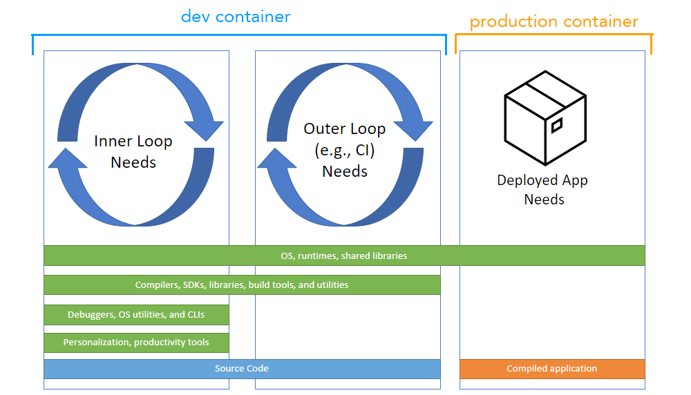

Dev Containers for Python development
=====================================

    Dev Containers or "Development Containers" is an open spec for enriching containers with development specific content and settings. Created by Microsoft, it was first supported by VS Code but now supported by IntelliJ IDEA, Cochix devenv, Jetpack.io, Codespaces, DevPod `and more <https://containers.dev/supporting>`__.

Quick links
-----------

- 📺 `Intro to Dev Containers + GitHub Codespaces : Live stream <https://www.youtube.com/watch?v=JTHTWp9DIZQ>`__

- 📃 `Open Spec : Documenation containers.dev <https://containers.dev/>`__

- 🏃🏽 `Install/Use with VS Code Tutorial <https://code.visualstudio.com/docs/devcontainers/tutorial>`__